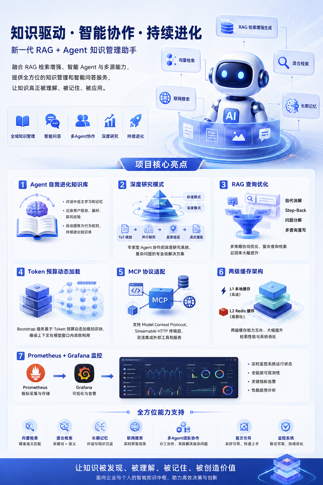

# MalogBot v2.0

<p align="center">
  
</p>

<p align="center">
  
  
  
  
  
  
  
  
  
  
  
</p>

基于 RAG（检索增强生成）和智能 Agent 的知识管理助手，集成了向量检索、混合检索、长期记忆、联网搜索、多Agent团队协作、Agent自我进化知识库、深度研究、MCP协议适配、RAG查询优化、首次引导、监控系统等功能，提供全方位的知识管理和智能问答服务。

## v2.0 新特性

相较于 v1.x，v2.0 新增了以下核心能力：

- **团队协作 v2 (Swarm模式)**：基于 LangGraph StateGraph 的全新编排架构，支持任务自动分解、DAG并行执行、结果智能整合
- **深度研究系统**：专家型Agent协作的深度研究系统，支持标准/深度两种模式，ToT规划+并行研究+反思验证+流式报告+PDF导出
- **RAG 查询优化器**：复杂查询自动优化，支持指代消解、Step-Back抽象、问题分解、多查询重写，大幅提升检索召回率
- **首次对话引导 (Onboarding)**：首次对话自动引导，建立用户画像和Agent身份，个性化体验
- **MCP Streamable HTTP 传输**：实现 MCP v2025.03.26 协议的 Streamable HTTP 传输层，统一消息入口+会话管理+动态SSE升级
- **消息持久化与断线重连**：研究进度实时持久化，会话切换后研究状态可恢复
- **上下文归档与恢复**：压缩前的完整对话历史归档存储，支持上下文回溯

核心亮点：
- **Agent 自我进化知识库**：Agent 可以在对话中自主学习和记忆，记录用户信息、偏好、踩坑经验，并自动提炼为行为规则
- **深度研究模式**：专家型Agent协作的深度研究系统，支持标准/深度两种模式，ToT规划+并行研究+反思验证+流式报告
- **RAG 查询优化**：指代消解 + Step-Back + 问题分解 + 多查询重写，复杂查询检索召回率大幅提升
- **Token 预算动态加载**：Bootstrap 服务基于 Token 预算动态加载知识块，确保上下文在模型窗口内高效利用
- **MCP 协议适配**：支持 Model Context Protocol，Streamable HTTP 传输层，灵活集成外部工具和服务
- **两级缓存架构**：L1 本地缓存 + L2 Redis 缓存，大幅提升检索性能
- **Prometheus + Grafana 监控**：完整的可观测性方案，实时监控系统运行状态

## 核心特性

### 智能对话
- 基于 LangGraph 的 Agent 架构
- 流式响应（SSE），支持 token-by-token 输出
- 多轮对话支持，会话历史管理
- 命令确认机制，危险操作检测

### 首次对话引导 (Onboarding)
- 首次对话自动检测，引导用户建立身份
- 智能解析用户回复，提取姓名、角色偏好
- 自动填充 SOUL 和 USER 知识块
- 个性化对话体验

### Agent 自我进化知识库
- **自主记忆**：Agent 在对话中主动识别重要信息并记录
- **用户画像**：自动记录用户姓名、职业、公司等信息
- **偏好学习**：记录用户的沟通风格、技术偏好、工作流程偏好
- **踩坑记录**：自动记录失败经验，提炼为行为规则
- **规则演化**：踩坑经验可自动转化为规则，避免重复犯错

知识块类型：

| 类型 | 说明 | 缓存 TTL |
|------|------|----------|
| SOUL | Agent 核心身份、价值观 | 1 小时 |
| USER | 用户画像和偏好 | 10 分钟 |
| AGENTS | 行为规则和踩坑经验 | 5 分钟 |
| MEMORY | 长期记忆条目 | 3 分钟 |

### Bootstrap 动态加载
基于 Token 预算的知识加载服务：
- 固定加载 SOUL（核心身份）
- 动态加载 USER（用户画像）
- 智能加载 AGENTS（规则优先 + 近期踩坑）
- 按需加载 MEMORY（长期记忆检索）
- 动态检索（基于用户查询）
- 质量门槛过滤（低质量内容自动过滤）

### 多Agent团队协作

支持两代团队协作架构：

**v1 (Leader-Follower模式)**
- 智能路由：自动判断任务复杂度，选择单Agent或团队模式
- 任务拆解：LLM驱动的复杂任务分解，自动构建DAG依赖图
- 并行执行：基于依赖关系的并行任务调度，最大化执行效率
- 流式反馈：实时推送任务进度，前端可视化展示
- 弹性扩展：动态Follower池管理，按需创建和回收资源

**v2 (Swarm模式)**
- 基于 LangGraph StateGraph 的状态机编排
- TaskDecomposer：LLM驱动的任务自动分解
- FollowerExecutor：独立子任务并行执行
- ResultIntegrator：LLM智能整合子任务结果
- 更简洁的架构，更可靠的执行流程

### RAG 知识库
- 混合检索（向量 + BM25），支持权重配置
- HNSW 向量索引，快速相似度搜索
- 智能重排序（阿里云百炼 Rerank）
- MMR 多样性重排序，避免重复内容
- 时间衰减加权，最近的记忆权重更高

### RAG 查询优化器
复杂查询的自动优化处理：

| 优化策略 | 说明 | 触发条件 |
|----------|------|----------|
| 指代消解 | 解析"它""那个"等指代词 | 对话型查询 |
| Step-Back | 生成更抽象的高层问题 | 概念理解型查询 |
| 问题分解 | 将复杂问题拆分为子问题 | 复杂长句查询 |
| 多查询重写 | 生成同一问题的多种表述 | 提升召回率 |

成本控制：子问题数量 <= 5，每子问题查询变体 <= 3

### 三层上下文架构
- Journal（JSONL）：原始消息存储，支持归档和恢复
- Memory（向量）：长期记忆，支持语义检索
- Summary：当前上下文摘要
- 上下文归档：压缩前完整对话归档存储，支持回溯
- 自动压缩机制，控制 Token 消耗

### 两级缓存系统
- L1 缓存：本地内存缓存（快速访问）
- L2 缓存：Redis 分布式缓存（跨实例共享）
- 自动失效机制：TTL 到期自动清理
- LRU 淘汰策略：内存压力大时自动淘汰

### 深度研究
- 两种研究模式：标准研究（直接执行）和深度研究（澄清+计划确认后执行）
- 三类专家型 Agent：探索型（搜索去重）、分析型（信息提炼+反思验证）、总结型（阶段总结+全篇报告）
- 状态机驱动流程：PENDING -> ANALYZING -> PENDING_CLARIFICATION -> PLANNING -> PENDING_CONFIRMATION -> CONFIRMED -> EXECUTING -> COMPLETED
- 多方向并行研究：研究方向间完全并行，方向内探索->分析->总结串行
- Human-in-the-loop：深度模式下先追问澄清、生成研究计划确认后执行
- 分层去重机制：Track 本地去重 + Session 全局去重(Redis) + 向量相似度去重(>0.88)
- 网页内容清洗：trafilatura/BeautifulSoup 双方案，去除 HTML/脚本/广告噪音
- 分析型 Agent 反思循环：检查信息冲突、验证准确性、判断是否补充检索（最多 3 轮）
- 流式报告生成：LLM 流式生成 Markdown 报告，实时推送给前端
- PDF 导出：weasyprint 后台异步生成，不阻塞报告查看
- SSE 实时进度推送：状态变更、方向进度、澄清问题、计划确认等事件
- 消息持久化：研究进度实时持久化，会话切换后状态可恢复

### MCP 协议适配
- Model Context Protocol 标准
- Streamable HTTP 传输层（MCP v2025.03.26）
  - 统一消息入口：所有消息通过单一 /message 端点
  - 会话管理：服务器可返回 Mcp-Session-Id 头
  - 动态 SSE 升级：服务器可将请求升级为 SSE 连接
- MCP Server 注册与管理
- 外部工具动态集成
- 百度云 MCP Web Search 集成

### 联网搜索
- 百度云 MCP Web Search 集成
- 获取实时信息
- 支持会话级别开关

### 监控系统
- Prometheus 指标收集
- Grafana 可视化仪表盘
- 关键指标：
  - Bootstrap 加载指标（Token 使用率、各知识块分布）
  - 检索质量指标（召回率、平均得分）
  - 知识库状态指标（条目数量、向量覆盖）
  - 缓存命中率

### 前端界面
- Vue 3 + TypeScript 现代化前端
- Tailwind CSS 4.0 样式系统
- 流式对话界面（SSE 实时渲染）
- 团队协作进度可视化
- 深度研究时间线展示
- 澄清问题交互卡片
- 研究计划确认卡片
- 研究完成结果卡片
- 知识库管理弹窗
- MCP 服务器管理弹窗
- 命令确认交互卡片

### 工具系统
- Bash 工具：执行命令，支持安全检测
- Memory 工具：主动存储重要信息
- Knowledge 工具：知识库管理（记录用户信息、偏好、踩坑）
- Task 工具：任务创建和管理
- Todo 工具：待办事项管理
- Skills 工具：自定义技能扩展
- Sub Agent：子代理协作（支持 default/fork 两种模式）
- Context Compact：手动触发上下文压缩

### 检索评估系统
- RAGAS 评估框架集成
- 支持大规模检索评测
- 自动化评估报告生成

## 技术栈

### 后端

| 类别 | 技术 |
|------|------|
| 语言 | Python 3.11+ |
| Web 框架 | Flask |
| LLM 框架 | LangChain, LangGraph |
| 大语言模型 | DeepSeek API |
| 数据库 | PostgreSQL 15+ (pgvector) |
| 缓存 | Redis 7.0+ |
| 向量化服务 | 阿里云百炼 (text-embedding-v4) |
| 重排序服务 | 阿里云百炼 (qwen3-vl-rerank) |
| 联网搜索 | 百度云 MCP |
| 流式响应 | Server-Sent Events (SSE) |
| 文档解析 | pdfplumber, python-docx |
| 网页清洗 | trafilatura, BeautifulSoup |
| PDF 生成 | weasyprint |
| 监控 | Prometheus, Grafana |
| 评估 | RAGAS |

### 前端

| 类别 | 技术 |
|------|------|
| 框架 | Vue 3 |
| 语言 | TypeScript 6.0+ |
| 构建工具 | Vite 8.0+ |
| 样式 | Tailwind CSS 4.0+ |
| 状态管理 | Vue Store (Pinia) |
| 图标库 | Lucide Vue Next |
| Markdown 渲染 | marked |
| 代码高亮 | highlight.js |
| SSE 客户端 | @microsoft/fetch-event-source |
| 工具函数 | @vueuse/core |

## 项目结构

```
malogbot/
├── app.py                    # Flask 应用主入口
├── config.py                 # 配置管理模块
├── requirements.txt          # 项目依赖
├── docker-compose.yml        # Docker Compose 编排文件
├── Dockerfile                # Docker 镜像构建文件（多阶段构建）
├── deploy.sh                 # 一键部署脚本
├── start_db.sh               # 数据库管理脚本
│
├── api/                      # API 路由层
│   └── research.py           # 深度研究 API
│
├── agent/                    # Agent 模块
│   ├── llm.py               # LLM 客户端封装
│   ├── planning/            # 规划模块
│   ├── prompts/             # 提示词模板
│   ├── team/                # 多Agent团队协作 v1（Leader-Follower模式）
│   ├── team_v2/             # 多Agent团队协作 v2（Swarm模式）
│   └── tools/               # 工具模块
│       ├── bash.py          # Bash 命令工具
│       ├── memory.py        # 记忆工具
│       ├── knowledge_tools.py # 知识库工具
│       ├── skills.py        # 技能工具
│       ├── sub_agent.py     # 子代理工具
│       ├── task_manager.py  # 任务管理工具
│       ├── todo_manager.py  # 待办管理工具
│       ├── context_compact.py # 上下文压缩工具
│       ├── subagent/        # 子代理实现
│       └── task/            # 任务工具实现
│
├── services/                 # 服务层
│   ├── agent/               # Agent 服务（流式处理、工具管理）
│   ├── bootstrap/           # Bootstrap 动态加载
│   ├── chat/                # 聊天服务
│   ├── context/             # 上下文管理
│   │   ├── session_store.py # 会话存储（数据库+JSONL双写）
│   │   ├── conversation_journal.py # 对话日志（JSONL）
│   │   ├── context_compactor.py # 三层上下文压缩
│   │   └── long_term_memory.py   # 长期记忆（向量检索+Rerank）
│   ├── core/                # 核心抽象接口与类型定义
│   ├── deep_research/       # 深度研究服务
│   │   ├── agents/          # 专家型Agent
│   │   │   ├── explorer_agent.py  # 探索型
│   │   │   ├── analyzer_agent.py  # 分析型
│   │   │   └── synthesizer_agent.py # 总结型
│   │   ├── utils/           # 研究工具
│   │   │   ├── content_cleaner.py  # 网页内容清洗
│   │   │   └── deduplicator.py     # 分层去重
│   │   ├── state_machine.py # 状态机驱动流程
│   │   ├── track.py         # ResearchTrack 执行单元
│   │   ├── event_buffer.py  # SSE 事件缓冲
│   │   ├── report_generator.py # 报告生成器
│   │   └── pdf_exporter.py  # PDF 导出器
│   ├── infrastructure/      # 基础设施（数据库、缓存、分词器）
│   ├── knowledge/           # 知识分块、评估、仓储
│   ├── knowledge_base/      # 知识库管理服务
│   ├── memory/              # 记忆服务（演化、搜索、智能记忆）
│   ├── monitoring/          # 监控指标收集
│   ├── rag/                 # RAG 检索服务
│   │   ├── query_optimizer.py    # 查询优化器
│   │   ├── rag_service.py        # RAG 服务
│   │   └── ...                   # 向量、BM25、MMR、混合检索
│   ├── onboarding_service.py     # 首次对话引导
│   └── session_store.py     # 会话存储服务
│
├── models/                   # 数据模型
│   ├── database.py          # 核心模型（Session, Message, ContextArchive, LongTermMemory）
│   ├── research.py          # 深度研究模型（ResearchTask, ResearchPlan, ResearchReport）
│   ├── agent_knowledge.py   # Agent 知识模型
│   ├── knowledge_base.py    # 知识库模型
│   └── mcp_server.py        # MCP 服务器模型
│
├── frontend/                 # 前端应用
│   └── src/
│       ├── api/              # API 请求封装
│       ├── components/
│       │   ├── chat/         # 聊天组件
│       │   │   ├── MessageItem.vue       # 消息气泡
│       │   │   ├── MessageList.vue       # 消息列表
│       │   │   ├── ConfirmationCard.vue  # 命令确认
│       │   │   ├── ClarificationCard.vue # 澄清问题
│       │   │   ├── PlanConfirmCard.vue   # 研究计划确认
│       │   │   ├── ResearchProgressCard.vue # 研究进度
│       │   │   ├── ResearchCompletedCard.vue # 研究完成
│       │   │   ├── TeamProgressCard.vue  # 团队进度
│       │   │   └── RecursionLimitCard.vue # 递归限制
│       │   ├── layout/      # 布局组件（侧边栏、聊天视图、欢迎页）
│       │   ├── modal/       # 弹窗组件（知识库管理、MCP管理）
│       │   └── ui/          # 基础UI组件
│       ├── composables/     # 组合式函数（流式响应等）
│       ├── stores/          # 状态管理
│       ├── styles/          # 全局样式
│       ├── types/           # TypeScript 类型定义
│       └── utils/           # 工具函数
│
├── mcp/                      # MCP 协议适配
│   ├── api.py               # MCP REST API
│   ├── registry.py          # 服务注册管理器
│   ├── adapters.py          # 工具适配器
│   ├── tools.py             # 工具管理器
│   └── transport/           # 传输层
│       ├── base.py          # 传输层基类
│       └── streamable_http.py # Streamable HTTP 传输实现
│
├── monitoring/               # 监控系统
│   ├── prometheus.yml       # Prometheus 配置
│   └── grafana/provisioning/ # Grafana 配置（仪表盘、数据源）
│
├── evaluation/               # 检索评估系统
│   └── tests/               # 评估测试
│
├── scripts/                  # 脚本工具
│   ├── migrations/          # 数据库迁移
│   │   ├── init_db.py              # 初始化核心表
│   │   ├── init_agent_knowledge_tables.py # Agent知识表
│   │   ├── init_kb_tables.py       # 知识库表
│   │   ├── init_mcp_tables.py      # MCP服务表
│   │   ├── init_research_tables.py # 深度研究表
│   │   ├── migrate_context_tables.py # 上下文归档表
│   │   ├── migrate_memory_chunks.py # 记忆分块表
│   │   └── migrate_add_onboarding.py # 引导字段
│   └── tools/               # 工具脚本
│
├── tests/                    # 测试目录
│   ├── deep_research/       # 深度研究测试
│   ├── test_sandbox/        # 沙箱测试
│   └── ...                  # 各模块单元测试
│
├── skills/                   # 技能模块
├── guide/                    # 教程文档
├── docs/                     # 设计文档
├── dicts/                    # 拼音词库
├── assert/                   # 图片资源
├── templates/                # HTML 模板
├── uploads/                  # 文件上传目录
└── archives/                 # 归档目录
    ├── journals/             # 对话日志归档
    └── transcripts/          # 转录归档
```

## 快速开始

### 方式一：Docker 一键部署（推荐）

```bash
# 1. 克隆项目
git clone https://github.com/hxxxi-malog/MalogBot.git
cd MalogBot

# 2. 复制环境变量配置文件
cp .env.example .env

# 3. 编辑 .env 文件，填入必要的 API Keys
# 必填项：DEEPSEEK_API_KEY, DASHSCOPE_API_KEY
vim .env

# 4. 启动所有服务
./deploy.sh start

# 5. 初始化数据库表（首次部署）
./deploy.sh init-db
```

服务访问地址：
- 应用：http://localhost:5000
- 数据库：localhost:5433
- Redis：localhost:6379

详细部署说明请参考 [部署](#部署) 章节。

### 方式二：手动安装

#### 环境要求

- Python 3.11+
- Docker（用于 PostgreSQL）
- Node.js 18+（用于前端构建）
- DeepSeek API Key
- 阿里云百炼 API Key（用于向量化和Rerank）
- 百度云 API Key（可选，用于联网搜索）

#### 安装步骤

```bash
# 1. 克隆项目
git clone https://github.com/hxxxi-malog/MalogBot.git
cd MalogBot

# 2. 创建虚拟环境
python -m venv .venv
source .venv/bin/activate  # macOS/Linux
# .venv\Scripts\activate   # Windows

# 3. 安装依赖
pip install -r requirements.txt

# 4. 启动数据库
./start_db.sh create

# 5. 配置环境变量
cp .env.example .env
vim .env  # 填入 API Keys

# 6. 初始化数据库
python scripts/migrations/init_db.py
python scripts/migrations/init_agent_knowledge_tables.py
python scripts/migrations/init_kb_tables.py
python scripts/migrations/init_mcp_tables.py
python scripts/migrations/init_research_tables.py

# 7. 构建前端
cd frontend
npm install
npm run build
cd ..

# 8. 运行应用
python app.py
```

## 核心功能

### 1. 知识库管理

- 创建和管理知识库
- 上传文档（PDF、DOCX、TXT、MD、JSON、CSV）
- 自动分块和向量化
- 文档删除和管理

### 2. 智能对话

- 基于 RAG 的知识问答
- 流式响应（SSE）
- 会话历史管理
- 多轮对话支持
- 命令确认机制
- 首次对话引导

### 3. Agent 自我进化

Agent 可以在对话中主动学习：

```python
# Agent 自动调用知识工具
remember_user_info(field="name", value="张三", confidence=1.0)
remember_preference(category="communication", preference="简洁回答", strength="strong")
record_mistake(mistake_type="execution", description="...", solution="...")
```

知识演化流程：
```
对话产生信息 -> Agent 识别重要性 -> 调用知识工具 -> 向量化存储
                                            |
                            下次对话 Bootstrap 加载 <- 质量过滤
```

### 4. 多Agent团队协作

系统支持两种执行模式：

**单Agent模式**
- 适用于简单问答、单步操作
- 直接调用LLM执行
- 快速响应，低延迟

**团队协作模式 v1 (Leader-Follower)**
- 适用于复杂任务（代码重构、系统迁移、批量操作等）
- 自动拆解为多个子任务
- DAG依赖分析与并行执行
- 实时进度反馈
- 结果智能整合

**团队协作模式 v2 (Swarm)**
- 基于 LangGraph StateGraph 的状态机编排
- 更简洁的架构，更可靠的执行流程
- 自动任务分解 + 并行执行 + 结果整合

### 5. RAG 检索

- 向量检索（HNSW 索引）
- BM25 关键词检索
- 混合检索（加权融合）
- 智能重排序（Rerank）
- MMR 多样性优化
- 时间衰减加权
- 查询优化（指代消解/Step-Back/问题分解/多查询重写）

### 6. Bootstrap 动态加载

Token 预算动态分配：

```
总预算 (16000 tokens)
    |
    |-- SOUL (固定): ~500 tokens
    |-- USER (动态): ~1000 tokens
    |-- AGENTS (智能): ~2000 tokens
    |       |-- 规则优先
    |       +-- 近期踩坑
    |-- MEMORY (检索): ~4000 tokens
    |       |-- 向量相似度 70%
    |       |-- BM25 关键词 30%
    |       |-- MMR 去重
    |       +-- 时间衰减
    +-- 动态检索 (剩余): ~8000 tokens
```

### 7. 上下文管理

三层架构设计：

- Journal（JSONL）：原始消息存储，支持归档和恢复
- Memory（向量）：长期记忆，语义检索
- Summary：当前上下文，自动压缩
- 上下文归档：压缩前完整对话归档，可回溯

### 8. 工具系统

Agent 可用工具：

- bash：执行 Bash 命令
- memory：存储重要信息到长期记忆
- remember_user_info：记录用户个人信息
- remember_preference：记录用户偏好
- record_mistake：记录踩坑经验
- skills：加载和执行自定义技能
- sub_agent：创建子代理处理子任务（default/fork 两种模式）
- task_manager：任务管理
- todo_manager：TODO 管理
- context_compact：手动触发上下文压缩

### 9. 深度研究

系统支持深度研究模式，通过专家型 Agent 协作完成复杂研究任务。

**两种研究模式**：
- **标准研究**：直接生成研究计划并执行，适合快速了解
- **深度研究**：先 LLM 分析问题 -> 追问澄清（最多3个问题）-> 用 ToT 生成研究计划 -> 用户确认后执行

**专家型 Agent 架构**：

| Agent 类型 | 职责 | 关键能力 |
|-----------|------|----------|
| 探索型 Agent | 搜索、发现信息 | 关键词优化、多源搜索、去重过滤、内容清洗 |
| 分析型 Agent | 分析搜索结果 | 信息提取、观点归纳、质量评估、反思验证（最多3轮） |
| 总结型 Agent | 生成研究报告 | 阶段总结、全篇报告、流式生成、来源整理 |

**研究执行流程**：
```
用户问题
    |
拆分为多个研究方向
    |
+------------------+------------------+
|                  |                  |
v                  v                  v
研究方向A         研究方向B         研究方向C   <- 方向间并行
|                  |                  |
v                  v                  v
探索型 Agent      探索型 Agent      探索型 Agent
|                  |                  |
v                  v                  v
分析型 Agent      分析型 Agent      分析型 Agent <- 方向内串行
|                  |                  |
v                  v                  v
总结型 Agent      总结型 Agent      总结型 Agent
+------------------+------------------+
                   |
                   v
         总结型 Agent（全篇报告流式生成）
                   |
                   v
         后台异步生成 PDF
```

**核心机制**：
- 状态机驱动：严格的状态转换 DAG，幂等性保障
- ResearchTrack：每个方向独立的运行时执行单元，含去重缓存和执行步骤
- SSE 网关：多 Track 消息路由，单连接多路复用
- 用户干预：研究执行中可发送补充信息引导研究方向
- 消息持久化：研究进度实时持久化，会话切换后状态可恢复
- 报告结构：标题 -> 摘要 -> 各方向结论 -> 汇总分析 -> 用户问题回答 -> 参考来源

### 10. 安全机制

- 命令分类：读取类直接执行，执行类需确认
- 危险命令检测：sudo、rm、chmod 等
- 白名单机制：允许特定危险命令模式

## API 文档

### 会话管理

```
GET  /sessions                      # 获取会话列表
POST /sessions/new                  # 创建新会话
DELETE /sessions/<session_id>       # 删除会话
POST /sessions/<session_id>/switch  # 切换会话
GET  /sessions/<session_id>/info    # 获取会话详情（含研究任务）
GET  /sessions/<session_id>/knowledge-base  # 获取知识库设置
PUT  /sessions/<session_id>/knowledge-base  # 设置知识库
```

### 对话接口

```
POST /chat              # 非流式对话
POST /chat/stream       # 流式对话（SSE）
GET  /history           # 获取对话历史
POST /reset             # 重置会话
POST /stop              # 取消流式输出
POST /onboarding/reply  # 首次对话引导回复
```

### 命令确认

```
POST /confirm           # 确认执行命令（非流式）
POST /confirm/stream    # 确认执行命令（流式）
POST /cancel            # 取消命令执行
```

### 团队协作

```
GET  /team/status       # 获取团队执行状态
GET  /team/task-board   # 获取任务看板视图
```

### 深度研究

```
POST /api/research/start                      # 发起研究（standard/deep模式）
POST /api/research/<task_id>/resume            # 回答澄清问题后恢复研究
POST /api/research/<task_id>/cancel            # 取消研究
GET  /api/research/<task_id>/status            # 获取研究状态
GET  /api/research/<task_id>/plan              # 获取研究计划
PUT  /api/research/<task_id>/plan              # 修改研究计划
POST /api/research/<task_id>/confirm           # 确认研究计划并开始执行
GET  /api/research/<task_id>/report/download   # 下载 PDF 报告
GET  /api/research/<task_id>/events            # SSE 实时研究进度推送
GET  /api/research/history                     # 历史研究记录列表
POST /api/research/<task_id>/intervention      # 研究中用户干预
```

### 任务继续

```
POST /continue          # 继续执行（非流式）
POST /continue/stream   # 继续执行（流式）
```

### 联网搜索

```
GET  /web-search/status  # 获取状态
POST /web-search/toggle  # 切换开关
```

### 知识库管理

```
GET  /knowledge-bases                  # 获取知识库列表
POST /knowledge-bases                  # 创建知识库
GET  /knowledge-bases/<kb_id>          # 获取知识库详情
DELETE /knowledge-bases/<kb_id>        # 删除知识库
GET  /knowledge-bases/<kb_id>/documents  # 获取文档列表
POST /knowledge-bases/<kb_id>/documents  # 上传文档
DELETE /documents/<doc_id>             # 删除文档
```

### MCP 服务管理

```
GET  /api/mcp/servers                  # 获取 MCP 服务器列表
POST /api/mcp/servers                  # 注册 MCP 服务器
GET  /api/mcp/servers/<server_id>      # 获取服务器详情
DELETE /api/mcp/servers/<server_id>    # 删除服务器
POST /api/mcp/servers/<server_id>/start  # 启动服务
POST /api/mcp/servers/<server_id>/stop   # 停止服务
GET  /api/mcp/servers/<server_id>/tools  # 获取服务工具列表
POST /api/mcp/servers/<server_id>/execute # 执行 MCP 工具
```

### 监控指标

```
GET  /monitoring/bootstrap   # Bootstrap 加载指标
GET  /monitoring/retrieval   # 检索质量指标
GET  /monitoring/knowledge   # 知识库状态指标
GET  /monitoring/alerts      # 监控告警
GET  /monitoring/prometheus  # Prometheus 格式指标导出
```

## 配置说明

### 检索配置

可在 `.env` 中调整检索策略：

```bash
# 混合检索开关
ENABLE_HYBRID_SEARCH=true

# 权重配置
BM25_WEIGHT=0.3          # 关键词匹配权重
VECTOR_WEIGHT=0.7        # 语义相似度权重

# MMR 多样性
ENABLE_MMR=true
MMR_ALPHA=0.7            # 相关性权重（越大越偏向相关性）

# 检索数量
RAG_TOP_N=10             # 初始检索数量
RAG_TOP_K=3              # 最终返回数量

# 查询优化
ENABLE_ENHANCED_RAG=true  # 启用查询优化
QUERY_OPT_ENABLE_COREFERENCE=true   # 启用指代消解
QUERY_OPT_ENABLE_STEP_BACK=true     # 启用 Step-Back
QUERY_OPT_ENABLE_DECOMPOSITION=true # 启用问题分解
QUERY_OPT_ENABLE_MULTI_QUERY=true   # 启用多查询重写
QUERY_OPT_MAX_SUB_QUESTIONS=5       # 最大子问题数
QUERY_OPT_MAX_VARIANTS=3            # 每子问题最大查询变体数
```

### Bootstrap 配置

```bash
# Token 预算
BOOTSTRAP_KNOWLEDGE_BUDGET=8000   # 知识块预算
BOOTSTRAP_MEMORY_BUDGET=4000      # 长期记忆预算

# 质量门槛
BOOTSTRAP_QUALITY_THRESHOLD=0.3   # 低于此值的内容被过滤

# 缓存 TTL（秒）
CACHE_TTL_SOUL=3600       # 1小时
CACHE_TTL_USER=600        # 10分钟
CACHE_TTL_AGENTS=300      # 5分钟
CACHE_TTL_RETRIEVAL=180   # 3分钟
```

### 上下文配置

```bash
# 最大上下文窗口
MAX_CONTEXT_TOKENS=128000

# 压缩阈值比例
COMPACT_THRESHOLD_RATIO=0.8

# 长期记忆
ENABLE_LONG_TERM_MEMORY=true
MEMORY_TOKEN_BUDGET=2000
MEMORY_RELEVANCE_THRESHOLD=0.65

# 压缩保留
KEEP_RECENT_MESSAGES=10
KEEP_RECENT_TOOL_RESULTS=3
```

### 子Agent配置

```bash
# 子Agent模式
SUB_AGENT_DEFAULT_MODE=default  # default: 同进程 | fork: 独立进程
SUB_AGENT_FORK_TIMEOUT=300      # fork模式超时（秒）
SUB_AGENT_RECURSION_LIMIT=50    # 递归限制
```

### 模型配置

支持多种模型提供商：

- DeepSeek（默认）
- 兼容 OpenAI API 的服务

## 部署

详细的部署说明请参考 [快速开始](#快速开始) 章节。

### 部署脚本命令

```bash
./deploy.sh start       # 启动所有服务
./deploy.sh stop        # 停止所有服务
./deploy.sh restart     # 重启所有服务
./deploy.sh build       # 重新构建镜像
./deploy.sh logs [svc]  # 查看日志（可选指定服务）
./deploy.sh status      # 查看服务状态
./deploy.sh monitor     # 启动（含监控）
./deploy.sh init-db     # 初始化数据库
./deploy.sh clean       # 清理所有容器和数据
./deploy.sh help        # 显示帮助
```

### 服务访问地址

| 服务 | 地址 | 说明 |
|------|------|------|
| 应用 | http://localhost:5000 | MalogBot 主服务 |
| 数据库 | localhost:5433 | PostgreSQL |
| Redis | localhost:6379 | 缓存服务 |
| Prometheus | http://localhost:9090 | 监控服务（可选） |
| Grafana | http://localhost:3000 | 可视化面板（可选） |

#### 启动监控服务

```bash
# 启动包含监控的完整服务
./deploy.sh monitor

# 或使用 docker compose
docker compose --profile monitoring up -d
```

### Docker 手动部署

如果需要单独构建和运行：

```bash
# 构建镜像
docker build -t malogbot:2.0 .

# 运行容器（需要先启动数据库和 Redis）
docker run -d \
    --name malogbot \
    -p 5000:5000 \
    --env-file .env \
    malogbot:2.0
```

### 生产环境配置

- 修改 `.env` 中的敏感配置
- 设置 `FLASK_DEBUG=False`
- 修改 `SECRET_KEY` 为随机字符串
- 修改数据库和 Redis 密码
- 配置反向代理（Nginx）
- 启用 HTTPS
- 配置日志收集

### Nginx 反向代理配置示例

```nginx
server {
    listen 80;
    server_name your-domain.com;

    location / {
        proxy_pass http://localhost:5000;
        proxy_http_version 1.1;
        proxy_set_header Upgrade $http_upgrade;
        proxy_set_header Connection "upgrade";
        proxy_set_header Host $host;
        proxy_set_header X-Real-IP $remote_addr;
        proxy_set_header X-Forwarded-For $proxy_add_x_forwarded_for;
        proxy_read_timeout 300s;
    }
}
```

## 数据库管理

使用 `start_db.sh` 脚本管理数据库：

```bash
./start_db.sh create   # 创建并启动
./start_db.sh start    # 启动
./start_db.sh stop     # 停止
./start_db.sh restart  # 重启
./start_db.sh status   # 查看状态
./start_db.sh logs     # 查看日志
./start_db.sh connect  # 连接数据库
./start_db.sh backup   # 备份数据库
```

### 数据库迁移

```bash
# 核心表初始化
python scripts/migrations/init_db.py

# 各功能模块表
python scripts/migrations/init_agent_knowledge_tables.py
python scripts/migrations/init_kb_tables.py
python scripts/migrations/init_mcp_tables.py
python scripts/migrations/init_research_tables.py

# 增量迁移
python scripts/migrations/migrate_context_tables.py      # 上下文归档表
python scripts/migrations/migrate_memory_chunks.py       # 记忆分块表
python scripts/migrations/migrate_add_onboarding.py      # 引导字段
```

## 监控系统

### Grafana 可视化面板

<p align="center">
  
</p>

### 监控指标

Bootstrap 指标：
- `bootstrap_tokens_used`: Token 使用量
- `bootstrap_budget_total`: Token 预算
- `bootstrap_usage_ratio`: 使用率
- `bootstrap_items_loaded`: 加载条目数

检索指标：
- `retrieval_avg_score`: 平均检索得分
- `retrieval_result_count`: 检索结果数量
- `retrieval_latency_seconds`: 检索延迟

缓存指标：
- `cache_hit_rate`: 缓存命中率
- `cache_l1_hits`: L1 缓存命中
- `cache_l2_hits`: L2 缓存命中

## 开发指南

### 代码规范

- Python：遵循 PEP 8 规范
- 使用 dataclass 定义数据结构
- 抽象接口与具体实现分离
- 核心功能处添加日志打印便于调试
- 前端遵循 Vue 3 Composition API 规范

### 添加新工具

1. 在 `agent/tools/` 目录下创建新的工具文件
2. 继承 `langchain_core.tools.BaseTool` 类或使用 `@tool` 装饰器
3. 在 `agent/tools/registry.py` 中注册工具

### 添加新技能

1. 在 `skills/` 目录下创建新的技能目录
2. 编写 `SKILL.md` 文件定义技能
3. 系统会自动加载并识别技能

### 添加 MCP 服务

1. 通过 API 或前端注册 MCP 服务器
2. 支持 stdio、http、sse、streamable-http 四种传输类型
3. 系统自动发现并加载服务工具

### 测试

```bash
# 运行所有测试
python -m pytest tests/

# 运行特定模块测试
python -m pytest tests/test_bootstrap.py -v
python -m pytest tests/deep_research/ -v
python -m pytest tests/test_team_v2.py -v

# 运行前端测试
cd frontend && npm test

# 运行 Bootstrap 集成测试
python scripts/test_bootstrap_in_agent.py
```

## 架构设计

### 核心接口

系统采用依赖反转设计，高层模块依赖抽象接口：

- `ISessionStore`：会话存储接口
- `IContextCompactor`：上下文压缩接口
- `IAgentService`：Agent 服务接口
- `IRAGService`：RAG 检索接口
- `IEmbeddingService`：向量化服务接口
- `IKnowledgeBaseService`：知识库服务接口
- `ILongTermMemory`：长期记忆接口

### Bootstrap 架构

<p align="center">
  
</p>

### 三层上下文架构

实现三层渐进式上下文压缩策略：

| 层级 | 名称 | 说明 | 特点 |
|------|------|------|------|
| 第一层 | Journal | 原始消息实时存储到 JSONL | 支持完整恢复 |
| 第二层 | Memory | Agent 主动存储关键信息 | 向量化 + Rerank 检索 |
| 第三层 | Summary | 上下文摘要 | 减少当前窗口占用 |

**工作流程**：

1. 每条消息实时追加到 JSONL 文件（Journal 服务）
2. 当达到阈值（如 80% 上下文窗口），触发压缩
3. 压缩时：
   - 后台线程提取关键信息向量化存储（Memory 服务）
   - LLM 生成摘要替换旧消息
   - 保留最近的几条消息
4. Agent 可以主动调用工具存储重要信息到长期记忆
5. 对话时通过 RAG 检索相关记忆，使用 Rerank 过滤高相关性结果

### 多Agent团队协作架构

<p align="center">
  
</p>

**团队协作流程**：

1. 意图路由：分析请求复杂度，决定执行模式
2. 任务拆解：Leader Agent将复杂任务拆解为子任务
3. DAG构建：分析依赖关系，构建执行计划
4. 并行执行：Follower Pool并行执行就绪任务
5. 结果整合：LLM智能整合各子任务结果

### Agent 知识演化架构

<p align="center">
  
</p>

## 许可证

MIT License

## 联系方式

项目主页：[GitHub](https://github.com/hxxxi-malog/MalogBot/)

问题反馈：[Issues](https://github.com/hxxxi-malog/MalogBot/issues)
