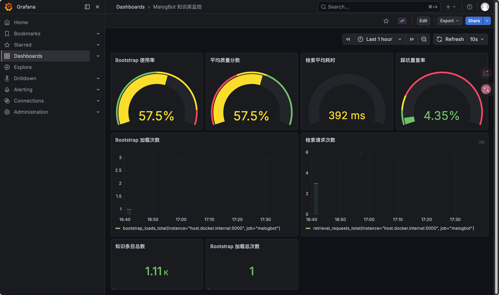
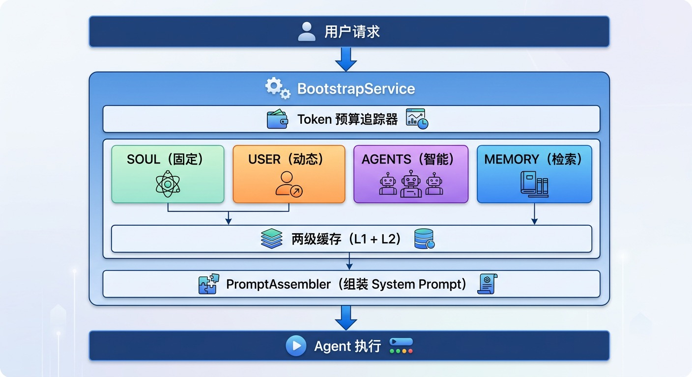
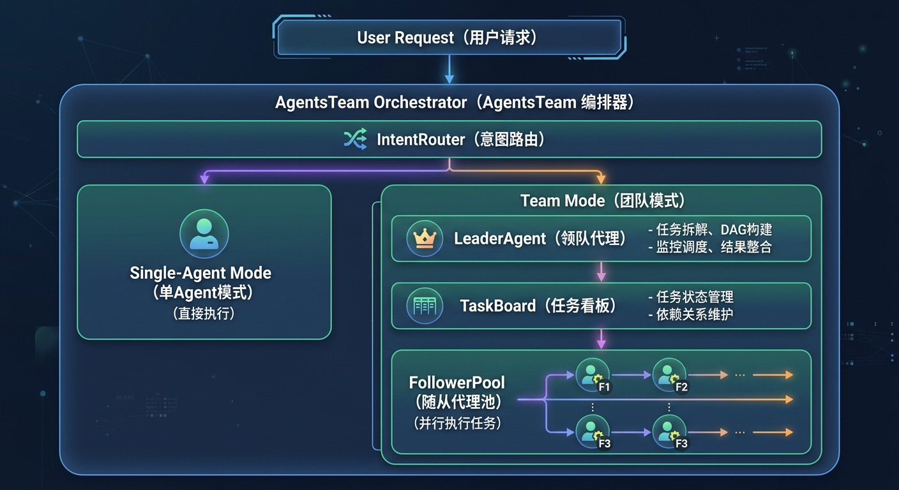
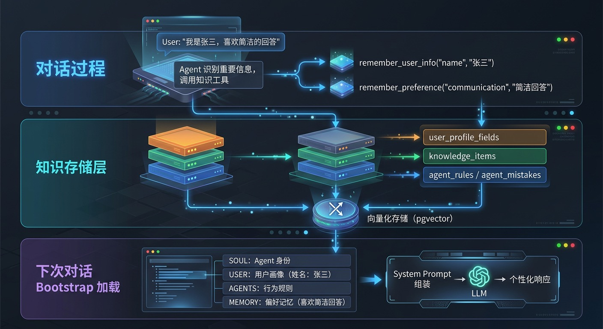

# MalogBot

<p align="center">
  
</p>

<p align="center">
  
  
  
  
  
  
</p>

基于 RAG（检索增强生成）和智能 Agent 的知识管理助手，集成了向量检索、混合检索、长期记忆、联网搜索、多Agent团队协作、Agent自我进化知识库、监控系统等功能，提供全方位的知识管理和智能问答服务。

## 项目简介

MalogBot 是一个企业级智能助手平台，通过 RAG 技术实现知识库问答，结合大语言模型的能力，实现智能对话、工具调用、任务管理、多Agent协作等功能。系统采用三层上下文架构，支持长期记忆和自动压缩，确保长对话场景下的稳定运行。

核心亮点：
- **Agent 自我进化知识库**：Agent 可以在对话中自主学习和记忆，记录用户信息、偏好、踩坑经验，并自动提炼为行为规则
- **Token 预算动态加载**：Bootstrap 服务基于 Token 预算动态加载知识块，确保上下文在模型窗口内高效利用
- **两级缓存架构**：L1 本地缓存 + L2 Redis 缓存，大幅提升检索性能
- **Prometheus + Grafana 监控**：完整的可观测性方案，实时监控系统运行状态

## 核心特性

### 智能对话
- 基于 LangGraph 的 Agent 架构
- 流式响应（SSE），支持 token-by-token 输出
- 多轮对话支持，会话历史管理
- 命令确认机制，危险操作检测

### Agent 自我进化知识库
- **自主记忆**：Agent 在对话中主动识别重要信息并记录
- **用户画像**：自动记录用户姓名、职业、公司等信息
- **偏好学习**：记录用户的沟通风格、技术偏好、工作流程偏好
- **踩坑记录**：自动记录失败经验，提炼为行为规则
- **规则演化**：踩坑经验可自动转化为规则，避免重复犯错

知识块类型： 

| 类型 | 说明 | 缓存 TTL |
|------|------|----------|
| SOUL | Agent 核心身份、价值观 | 1 小时 |
| USER | 用户画像和偏好 | 10 分钟 |
| AGENTS | 行为规则和踩坑经验 | 5 分钟 |
| MEMORY | 长期记忆条目 | 3 分钟 |

### Bootstrap 动态加载
基于 Token 预算的知识加载服务：
- 固定加载 SOUL（核心身份）
- 动态加载 USER（用户画像）
- 智能加载 AGENTS（规则优先 + 近期踩坑）
- 按需加载 MEMORY（长期记忆检索）
- 动态检索（基于用户查询）
- 质量门槛过滤（低质量内容自动过滤）

### 多Agent团队协作
- 智能路由：自动判断任务复杂度，选择单Agent或团队模式
- 任务拆解：LLM驱动的复杂任务分解，自动构建DAG依赖图
- 并行执行：基于依赖关系的并行任务调度，最大化执行效率
- 流式反馈：实时推送任务进度，前端可视化展示
- 弹性扩展：动态Follower池管理，按需创建和回收资源

### RAG 知识库
- 混合检索（向量 + BM25），支持权重配置
- HNSW 向量索引，快速相似度搜索
- 智能重排序（阿里云百炼 Rerank）
- MMR 多样性重排序，避免重复内容
- 时间衰减加权，最近的记忆权重更高

### 三层上下文架构
- Journal（JSONL）：原始消息存储
- Memory（向量）：长期记忆，支持语义检索
- Summary：当前上下文摘要
- 自动压缩机制，控制 Token 消耗

### 两级缓存系统
- L1 缓存：本地内存缓存（快速访问）
- L2 缓存：Redis 分布式缓存（跨实例共享）
- 自动失效机制：TTL 到期自动清理
- LRU 淘汰策略：内存压力大时自动淘汰

### 监控系统
- Prometheus 指标收集
- Grafana 可视化仪表盘
- 关键指标：
  - Bootstrap 加载指标（Token 使用率、各知识块分布）
  - 检索质量指标（召回率、平均得分）
  - 知识库状态指标（条目数量、向量覆盖）
  - 缓存命中率

### 工具系统
- Bash 工具：执行命令，支持安全检测
- Memory 工具：主动存储重要信息
- Knowledge 工具：知识库管理（记录用户信息、偏好、踩坑）
- Task 工具：任务创建和管理
- Skills 工具：自定义技能扩展
- Sub Agent：子代理协作

### 联网搜索
- 百度云 MCP Web Search 集成
- 获取实时信息
- 支持会话级别开关

### 检索评估系统
- RAGAS 评估框架集成
- 支持大规模检索评测
- 自动化评估报告生成

## 技术栈

### 后端

| 类别 | 技术 |
|------|------|
| 语言 | Python 3.10+ |
| Web 框架 | Flask |
| LLM 框架 | LangChain, LangGraph |
| 大语言模型 | DeepSeek API |
| 数据库 | PostgreSQL 15+ (pgvector) |
| 缓存 | Redis |
| 向量化服务 | 阿里云百炼 |
| 联网搜索 | 百度云 MCP |
| 流式响应 | Server-Sent Events (SSE) |
| 文档解析 | pdfplumber, python-docx |
| 监控 | Prometheus, Grafana |
| 评估 | RAGAS |

### 前端

| 类别 | 技术 |
|------|------|
| 模板引擎 | Jinja2 |
| 样式 | 原生 CSS |
| 交互 | 原生 JavaScript |

## 项目结构

```
malogbot/
├── app.py                    # Flask 应用主入口
├── config.py                 # 配置管理模块
├── requirements.txt          # 项目依赖
├── start_db.sh              # 数据库管理脚本
│
├── docker-compose.yml        # Docker Compose 编排文件
├── Dockerfile                # Docker 镜像构建文件
├── .dockerignore             # Docker 构建忽略文件
├── .env.example              # 环境变量示例文件
├── deploy.sh                 # 一键部署脚本
│
├── agent/                    # Agent 模块
│   ├── llm.py               # LLM 客户端封装
│   ├── prompts.py           # 提示词模板
│   ├── planning.py          # 规划模块
│   ├── team/                # 多Agent团队协作系统
│   │   ├── __init__.py      # 模块导出
│   │   ├── types.py         # 类型定义
│   │   ├── router.py        # 意图路由器
│   │   ├── leader.py        # Leader Agent
│   │   ├── task_board.py    # 任务看板
│   │   ├── follower.py      # Follower Agent
│   │   └── orchestrator.py  # 团队编排器
│   ├── team_v2/             # 团队系统v2（Swarm模式）
│   │   ├── orchestrator.py  # StateGraph编排器
│   │   ├── decomposer.py    # 任务分解器
│   │   ├── integrator.py    # 结果整合器
│   │   ├── follower.py      # Follower Agent
│   │   └── types.py         # 类型定义
│   └── tools/               # 工具模块
│       ├── bash.py          # Bash 命令执行
│       ├── memory.py        # 长期记忆存储
│       ├── knowledge_tools.py # 知识库工具
│       ├── skills.py        # 技能加载
│       ├── sub_agent.py     # 子代理
│       ├── task_manager.py  # 任务管理
│       ├── todo_manager.py  # TODO 管理
│       └── context_compact.py # 上下文压缩
│
├── services/                 # 服务层
│   ├── core/                # 核心模块
│   │   ├── interfaces.py    # 抽象接口定义
│   │   └── types.py         # 核心类型定义
│   ├── agent/               # Agent 服务
│   ├── bootstrap/           # Bootstrap 动态加载
│   │   ├── bootstrap_service.py  # 加载服务
│   │   ├── cache.py         # 两级缓存
│   │   ├── token_counter.py # Token 计数
│   │   ├── prompt_assembler.py # Prompt 组装
│   │   └── models.py        # 数据模型
│   ├── context/             # 上下文管理
│   │   ├── session_store.py       # 会话存储
│   │   ├── conversation_journal.py # 对话日志
│   │   ├── context_compactor.py   # 上下文压缩
│   │   └── long_term_memory.py    # 长期记忆
│   ├── rag/                 # RAG 检索服务
│   │   ├── rag_service.py         # 检索服务
│   │   ├── enhanced_rag_service.py # 增强版检索服务
│   │   ├── embedding_service.py   # 向量化服务
│   │   ├── bm25_service.py        # BM25 检索
│   │   ├── mmr_reranker.py        # MMR 重排序
│   │   └── query_optimizer.py     # 查询优化器
│   ├── knowledge_base/      # 知识库服务
│   ├── monitoring/          # 监控服务
│   │   ├── metrics_collector.py   # 指标收集器
│   │   └── __init__.py            # 模块导出
│   ├── agent_knowledge_repository.py # Agent 知识库 Repository
│   ├── memory_search_engine.py     # 记忆搜索引擎
│   ├── redis_service.py           # Redis 服务
│   └── db_manager.py              # 数据库管理
│
├── models/                   # 数据模型
│   ├── database.py          # 基础模型
│   ├── knowledge_base.py    # 知识库模型
│   └── agent_knowledge.py   # Agent 知识库模型
│
├── monitoring/               # 监控系统
│   ├── docker-compose.yml   # Prometheus + Grafana
│   ├── prometheus.yml       # Prometheus 配置
│   ├── grafana/             # Grafana 配置
│   │   └── provisioning/
│   │       ├── dashboards/  # 仪表盘配置
│   │       └── datasources/ # 数据源配置
│   ├── start.sh             # 启动监控
│   └── stop.sh              # 停止监控
│
├── evaluation/               # 评估系统
│   ├── retrieval_evaluation_service.py # 检索评估服务
│   ├── large_scale_evaluation.py       # 大规模评估
│   ├── evaluate_retrieval.py           # 评估脚本
│   └── tests/                # 评估测试
│
├── scripts/                  # 脚本工具
│   ├── migrations/          # 数据库迁移
│   │   ├── init_agent_knowledge_tables.py # 初始化知识库表
│   │   └── ...
│   ├── tools/               # 工具脚本
│   │   ├── rebuild_index.py       # 重建索引
│   │   └── ...
│   ├── diagnose_bootstrap.py # Bootstrap 诊断
│   └── migrate_memories.py   # 记忆迁移
│
├── tests/                    # 测试目录
│   ├── test_bootstrap.py    # Bootstrap 测试
│   ├── test_agent_knowledge.py # Agent 知识库测试
│   ├── test_team_v2.py      # 团队v2测试
│   └── ...
│
├── mcp/                      # MCP 协议适配
│   └── adapters.py          # 百度云 Web Search
│
├── skills/                   # 技能模块
│   ├── postgres-performance-diagnosis/
│   └── ui-ux-pro-max-skill/
│
├── docs/                     # 文档
│   ├── agent-self-evolution-knowledge-base-design.md # 知识库设计
│   ├── AgentTeam.md         # 团队协作文档
│   ├── database.md          # 数据库设计
│   └── memory-unification-plan.md # 记忆统一方案
│
├── assert/                   # 图片资源
├── templates/                # HTML 模板
├── uploads/                  # 文件上传目录
└── archives/                 # 归档目录
    ├── journals/            # 对话日志归档
    └── transcripts/         # 转录归档
```

## 快速开始

### 方式一：Docker 一键部署（推荐）

```bash
# 1. 克隆项目
git clone https://github.com/hxxxi-malog/MalogBot.git
cd MalogBot

# 2. 复制环境变量配置文件
cp .env.example .env

# 3. 编辑 .env 文件，填入必要的 API Keys
# 必填项：DEEPSEEK_API_KEY, DASHSCOPE_API_KEY
vim .env

# 4. 启动所有服务
./deploy.sh start

# 5. 初始化数据库表（首次部署）
./deploy.sh init-db
```

服务访问地址：
- 应用：http://localhost:5000
- 数据库：localhost:5433
- Redis：localhost:6379

详细部署说明请参考 [部署](#部署) 章节。

### 方式二：手动安装

#### 环境要求

- Python 3.10+
- Docker（用于 PostgreSQL）
- DeepSeek API Key
- 阿里云百炼 API Key（可选，用于 RAG）
- 百度云 API Key（可选，用于联网搜索）

#### 安装步骤

```bash
# 1. 克隆项目
git clone https://github.com/hxxxi-malog/MalogBot.git
cd MalogBot

# 2. 创建虚拟环境
python -m venv .venv
source .venv/bin/activate  # macOS/Linux
# .venv\Scripts\activate   # Windows

# 3. 安装依赖
pip install -r requirements.txt

# 4. 启动数据库
./start_db.sh create

# 5. 配置环境变量
cp .env.example .env
vim .env  # 填入 API Keys

# 6. 初始化数据库
python scripts/migrations/init_agent_knowledge_tables.py

# 7. 运行应用
python app.py
```

## 核心功能

### 1. 知识库管理

- 创建和管理知识库
- 上传文档（PDF、DOCX、TXT、MD、JSON、CSV）
- 自动分块和向量化
- 文档删除和管理

### 2. 智能对话

- 基于 RAG 的知识问答
- 流式响应（SSE）
- 会话历史管理
- 多轮对话支持
- 命令确认机制

### 3. Agent 自我进化

Agent 可以在对话中主动学习：

```python
# Agent 自动调用知识工具
remember_user_info(field="name", value="张三", confidence=1.0)
remember_preference(category="communication", preference="简洁回答", strength="strong")
record_mistake(mistake_type="execution", description="...", solution="...")
```

知识演化流程：
```
对话产生信息 → Agent 识别重要性 → 调用知识工具 → 向量化存储
                                              ↓
                              下次对话 Bootstrap 加载 ← 质量过滤
```

### 4. 多Agent团队协作

系统支持两种执行模式：

**单Agent模式**
- 适用于简单问答、单步操作
- 直接调用LLM执行
- 快速响应，低延迟

**团队协作模式**
- 适用于复杂任务（代码重构、系统迁移、批量操作等）
- 自动拆解为多个子任务
- DAG依赖分析与并行执行
- 实时进度反馈
- 结果智能整合

### 5. RAG 检索

- 向量检索（HNSW 索引）
- BM25 关键词检索
- 混合检索（加权融合）
- 智能重排序
- MMR 多样性优化
- 时间衰减加权

### 6. Bootstrap 动态加载

Token 预算动态分配：

```
总预算 (16000 tokens)
    │
    ├── SOUL (固定): ~500 tokens
    ├── USER (动态): ~1000 tokens
    ├── AGENTS (智能): ~2000 tokens
    │       ├── 规则优先
    │       └── 近期踩坑
    ├── MEMORY (检索): ~4000 tokens
    │       ├── 向量相似度 70%
    │       ├── BM25 关键词 30%
    │       ├── MMR 去重
    │       └── 时间衰减
    └── 动态检索 (剩余): ~8000 tokens
```

### 7. 上下文管理

三层架构设计：

- Journal（JSONL）：原始消息存储，支持归档
- Memory（向量）：长期记忆，语义检索
- Summary：当前上下文，自动压缩

### 8. 工具系统

Agent 可用工具：

- bash：执行 Bash 命令
- memory：存储重要信息到长期记忆
- remember_user_info：记录用户个人信息
- remember_preference：记录用户偏好
- record_mistake：记录踩坑经验
- skills：加载和执行自定义技能
- sub_agent：创建子代理处理子任务
- task_manager：任务管理
- todo_manager：TODO 管理
- context_compact：手动触发上下文压缩

### 9. 安全机制

- 命令分类：读取类直接执行，执行类需确认
- 危险命令检测：sudo、rm、chmod 等
- 白名单机制：允许特定危险命令模式

## API 文档

### 会话管理

```
GET  /sessions                      # 获取会话列表
POST /sessions/new                  # 创建新会话
DELETE /sessions/<session_id>       # 删除会话
POST /sessions/<session_id>/switch  # 切换会话
GET  /sessions/<session_id>/info    # 获取会话详情
GET  /sessions/<session_id>/knowledge-base  # 获取知识库设置
PUT  /sessions/<session_id>/knowledge-base  # 设置知识库
```

### 对话接口

```
POST /chat              # 非流式对话
POST /chat/stream       # 流式对话（SSE）
GET  /history           # 获取对话历史
POST /reset             # 重置会话
POST /stop              # 取消流式输出
```

### 命令确认

```
POST /confirm           # 确认执行命令（非流式）
POST /confirm/stream    # 确认执行命令（流式）
POST /cancel            # 取消命令执行
```

### 团队协作

```
GET  /team/status       # 获取团队执行状态
GET  /team/board        # 获取任务看板视图
```

### 任务继续

```
POST /continue          # 继续执行（非流式）
POST /continue/stream   # 继续执行（流式）
```

### 联网搜索

```
GET  /web-search/status  # 获取状态
POST /web-search/toggle  # 切换开关
```

### 知识库管理

```
GET  /knowledge-bases                  # 获取知识库列表
POST /knowledge-bases                  # 创建知识库
GET  /knowledge-bases/<kb_id>          # 获取知识库详情
DELETE /knowledge-bases/<kb_id>        # 删除知识库
GET  /knowledge-bases/<kb_id>/documents  # 获取文档列表
POST /knowledge-bases/<kb_id>/documents  # 上传文档
DELETE /documents/<doc_id>             # 删除文档
```

## 配置说明

### 检索配置

可在 `.env` 中调整检索策略：

```bash
# 混合检索开关
ENABLE_HYBRID_SEARCH=true

# 权重配置
BM25_WEIGHT=0.3          # 关键词匹配权重
VECTOR_WEIGHT=0.7        # 语义相似度权重

# MMR 多样性
ENABLE_MMR=true
MMR_ALPHA=0.7            # 相关性权重（越大越偏向相关性）

# 检索数量
RAG_TOP_N=10             # 初始检索数量
RAG_TOP_K=3              # 最终返回数量
```

### Bootstrap 配置

```bash
# Token 预算
BOOTSTRAP_KNOWLEDGE_BUDGET=8000   # 知识块预算
BOOTSTRAP_MEMORY_BUDGET=4000      # 长期记忆预算

# 质量门槛
BOOTSTRAP_QUALITY_THRESHOLD=0.3   # 低于此值的内容被过滤

# 缓存 TTL（秒）
CACHE_TTL_SOUL=3600       # 1小时
CACHE_TTL_USER=600        # 10分钟
CACHE_TTL_AGENTS=300      # 5分钟
CACHE_TTL_RETRIEVAL=180   # 3分钟
```

### 上下文配置

```bash
# 最大上下文窗口
MAX_CONTEXT_TOKENS=128000

# 压缩阈值比例
COMPACT_THRESHOLD_RATIO=0.8

# 长期记忆
ENABLE_LONG_TERM_MEMORY=true
MEMORY_TOKEN_BUDGET=2000
MEMORY_RELEVANCE_THRESHOLD=0.65
```

### 模型配置

支持多种模型提供商：

- DeepSeek（默认）
- 兼容 OpenAI API 的服务

## 部署

详细的部署说明请参考 [快速开始](#快速开始) 章节。

### 部署脚本命令

```bash
./deploy.sh start       # 启动所有服务
./deploy.sh stop        # 停止所有服务
./deploy.sh restart     # 重启所有服务
./deploy.sh build       # 重新构建镜像
./deploy.sh logs [svc]  # 查看日志（可选指定服务）
./deploy.sh status      # 查看服务状态
./deploy.sh monitor     # 启动（含监控）
./deploy.sh init-db     # 初始化数据库
./deploy.sh clean       # 清理所有容器和数据
./deploy.sh help        # 显示帮助
```

### 服务访问地址

| 服务 | 地址 | 说明 |
|------|------|------|
| 应用 | http://localhost:5000 | MalogBot 主服务 |
| 数据库 | localhost:5433 | PostgreSQL |
| Redis | localhost:6379 | 缓存服务 |
| Prometheus | http://localhost:9090 | 监控服务（可选） |
| Grafana | http://localhost:3000 | 可视化面板（可选） |

#### 启动监控服务

```bash
# 启动包含监控的完整服务
./deploy.sh monitor

# 或使用 docker compose
docker compose --profile monitoring up -d
```

### Docker 手动部署

如果需要单独构建和运行：

```bash
# 构建镜像
docker build -t malogbot .

# 运行容器（需要先启动数据库和 Redis）
docker run -d \
    --name malogbot \
    -p 5000:5000 \
    --env-file .env \
    malogbot
```

### 生产环境配置

- 修改 `.env` 中的敏感配置
- 设置 `FLASK_DEBUG=False`
- 修改 `SECRET_KEY` 为随机字符串
- 修改数据库和 Redis 密码
- 配置反向代理（Nginx）
- 启用 HTTPS
- 配置日志收集

### Nginx 反向代理配置示例

```nginx
server {
    listen 80;
    server_name your-domain.com;

    location / {
        proxy_pass http://localhost:5000;
        proxy_http_version 1.1;
        proxy_set_header Upgrade $http_upgrade;
        proxy_set_header Connection "upgrade";
        proxy_set_header Host $host;
        proxy_set_header X-Real-IP $remote_addr;
        proxy_set_header X-Forwarded-For $proxy_add_x_forwarded_for;
        proxy_read_timeout 300s;
    }
}
```

## 数据库管理

使用 `start_db.sh` 脚本管理数据库：

```bash
./start_db.sh create   # 创建并启动
./start_db.sh start    # 启动
./start_db.sh stop     # 停止
./start_db.sh restart  # 重启
./start_db.sh status   # 查看状态
./start_db.sh logs     # 查看日志
./start_db.sh connect  # 连接数据库
./start_db.sh backup   # 备份数据库
```

## 监控系统

### Grafana 可视化面板

<p align="center">
  
</p>

### 监控指标

Bootstrap 指标：
- `bootstrap_tokens_used`: Token 使用量
- `bootstrap_budget_total`: Token 预算
- `bootstrap_usage_ratio`: 使用率
- `bootstrap_items_loaded`: 加载条目数

检索指标：
- `retrieval_avg_score`: 平均检索得分
- `retrieval_result_count`: 检索结果数量
- `retrieval_latency_seconds`: 检索延迟

缓存指标：
- `cache_hit_rate`: 缓存命中率
- `cache_l1_hits`: L1 缓存命中
- `cache_l2_hits`: L2 缓存命中

## 开发指南

### 代码规范

- Python：遵循 PEP 8 规范
- 使用 dataclass 定义数据结构
- 抽象接口与具体实现分离
- 核心功能处添加日志打印便于调试

### 添加新工具

1. 在 `agent/tools/` 目录下创建新的工具文件
2. 继承 `langchain_core.tools.BaseTool` 类或使用 `@tool` 装饰器
3. 在 `agent/tools/__init__.py` 中注册工具

### 添加新技能

1. 在 `skills/` 目录下创建新的技能目录
2. 编写 `SKILL.md` 文件定义技能
3. 系统会自动加载并识别技能

### 测试

```bash
# 运行所有测试
python -m pytest tests/

# 运行特定测试
python -m pytest tests/test_bootstrap.py -v

# 运行 Bootstrap 集成测试
python scripts/test_bootstrap_in_agent.py
```

## 架构设计

### 核心接口

系统采用依赖反转设计，高层模块依赖抽象接口：

- `ISessionStore`：会话存储接口
- `IContextCompactor`：上下文压缩接口
- `IAgentService`：Agent 服务接口
- `IRAGService`：RAG 检索接口
- `IEmbeddingService`：向量化服务接口
- `IKnowledgeBaseService`：知识库服务接口
- `ILongTermMemory`：长期记忆接口

### Bootstrap 架构

<p align="center">
  
</p>

### 三层上下文架构

实现三层渐进式上下文压缩策略：

| 层级 | 名称 | 说明 | 特点 |
|------|------|------|------|
| 第一层 | Journal | 原始消息实时存储到 JSONL | 支持完整恢复 |
| 第二层 | Memory | Agent 主动存储关键信息 | 向量化 + Rerank 检索 |
| 第三层 | Summary | 上下文摘要 | 减少当前窗口占用 |

**工作流程**：

1. 每条消息实时追加到 JSONL 文件（Journal 服务）
2. 当达到阈值（如 80% 上下文窗口），触发压缩
3. 压缩时：
   - 后台线程提取关键信息向量化存储（Memory 服务）
   - LLM 生成摘要替换旧消息
   - 保留最近的几条消息
4. Agent 可以主动调用工具存储重要信息到长期记忆
5. 对话时通过 RAG 检索相关记忆，使用 Rerank 过滤高相关性结果

### 多Agent团队协作架构

<p align="center">
  
</p>

**团队协作流程**：

1. 意图路由：分析请求复杂度，决定执行模式
2. 任务拆解：Leader Agent将复杂任务拆解为子任务
3. DAG构建：分析依赖关系，构建执行计划
4. 并行执行：Follower Pool并行执行就绪任务
5. 结果整合：LLM智能整合各子任务结果

### Agent 知识演化架构

<p align="center">
  
</p>

## 许可证

MIT License

## 联系方式

项目主页：[GitHub](https://github.com/hxxxi-malog/MalogBot/)

问题反馈：[Issues](https://github.com/hxxxi-malog/MalogBot/issues)
